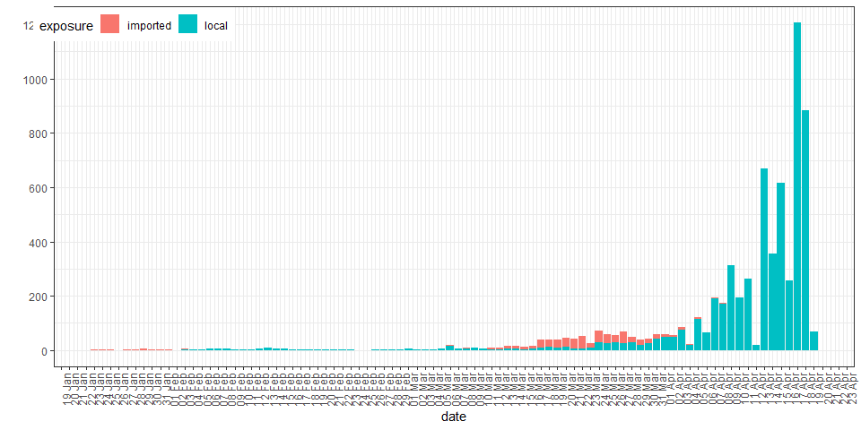
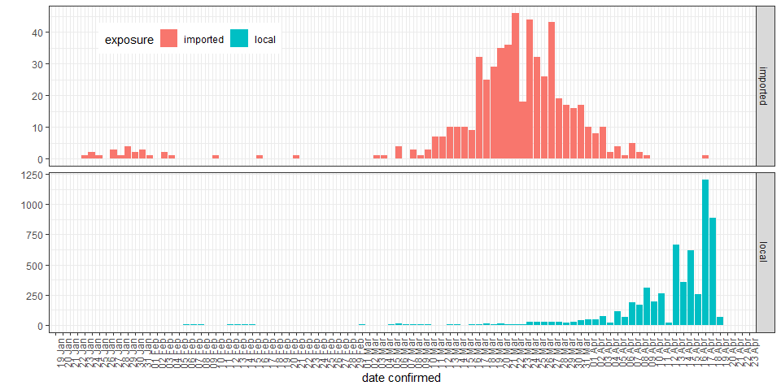
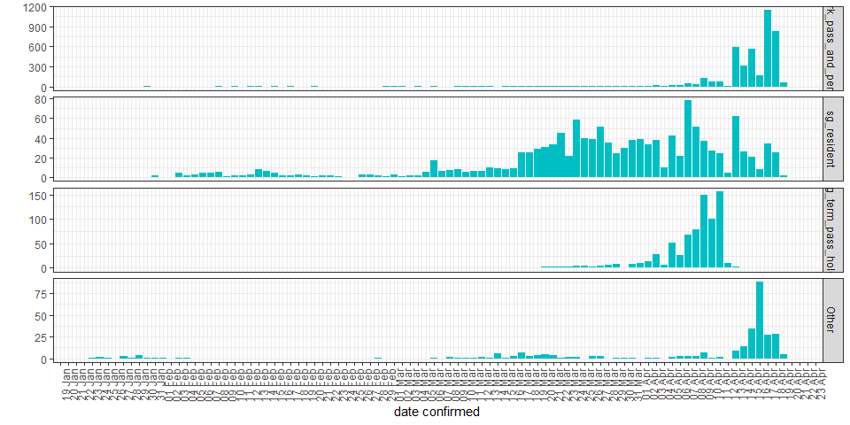

##### Data as at 2020-04-18

### Overview

  

### Number of cases based on dates confirmed
<!-- -->

### Number of cases by type of exposure

<!-- -->

### Number of cases by passport type
<!-- -->

